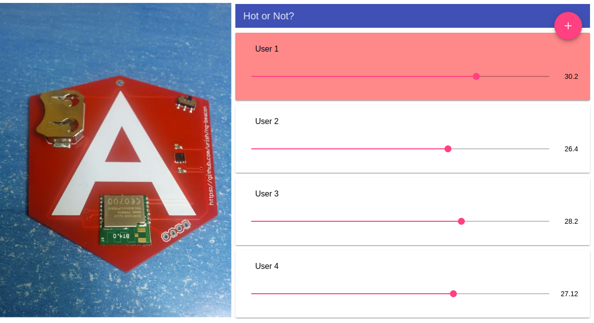

# Hot or Not?

A small [ng-beacon](https://ngbeacon.io/) game I created for my [ngVikings](https://ngVikings.org) talk.

## Game objective

Each player gets an ng-beacon set up with a temperature sensors. Each player holds the beacon, trying to warm it up as much 
as possible. The player with the (literally) hottest beacon wins!

[Talk Slides](http://goo.gl/0aVXFW)
